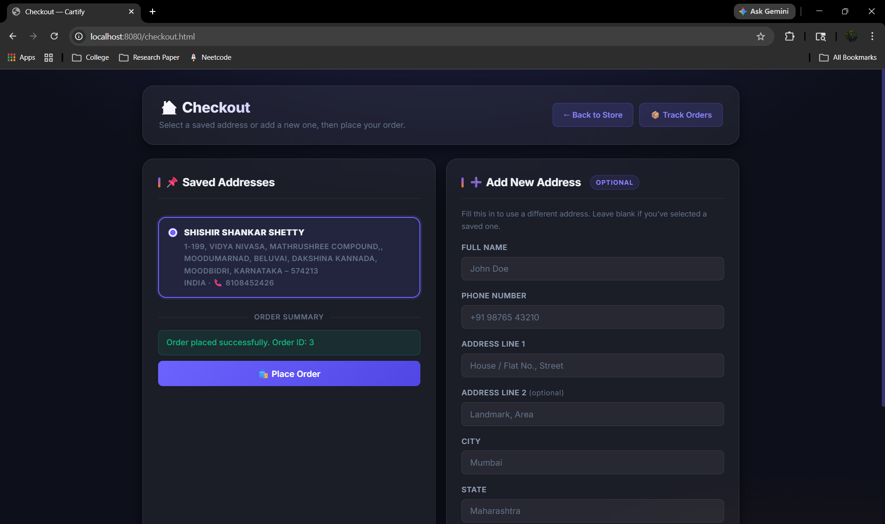
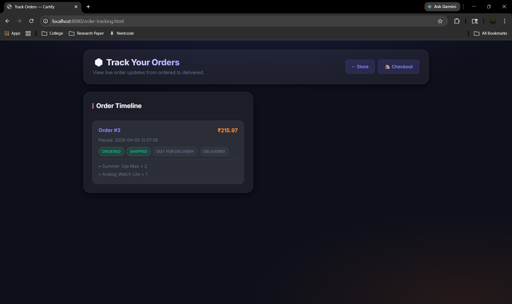
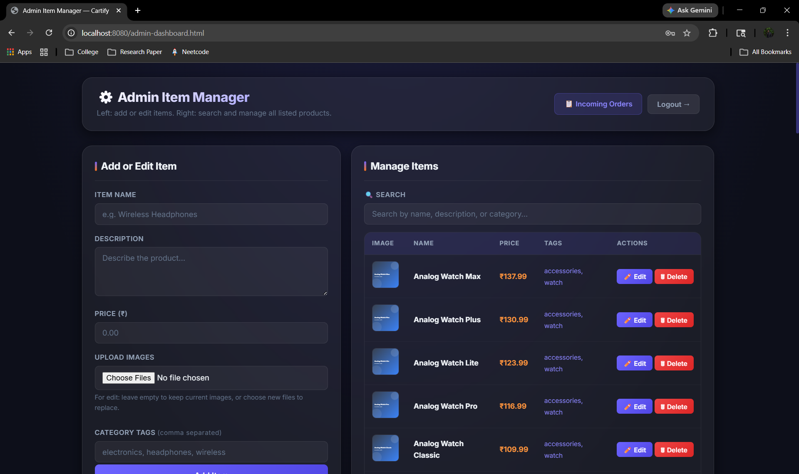

# 🛒 Cartify

Cartify streamlines online shopping by helping users discover products, manage carts, and complete purchases quickly with a smooth, intuitive experience.

---

## 📸 Screenshots

|  |
|:--:|

|  |  |  |
|:--:|:--:|:--:|

|  |  |  |
|:--:|:--:|:--:|

|  |  |  |
|:--:|:--:|:--:|

> 🖼️ Click on any image to view it in full size.

---

## ✨ Features

* 🛍️ Browse products with details, pricing, and category tags.
* 🛒 Add items to cart and update quantities seamlessly.
* 📦 Complete checkout with shipping address management.
* 🔍 Track customer orders with status updates.
* 👤 User authentication with customer and admin roles.
* 🛠️ Admin dashboard to manage items and monitor orders.

---

## 🚀 Tech Stack

* **Backend Framework:** Spring Boot 4
* **Language:** Java 25
* **Web Layer:** Spring Web MVC
* **Database:** SQLite
* **Data Access:** Spring JDBC
* **Build Tool:** Gradle

---

## 🛠️ Setup Instructions

Clone the repository and get started!

```bash
# 1. Clone the repo
git clone <your-repository-url>
cd cartify

# 2. Build the project
./gradlew build

# 3. Start the application
./gradlew bootRun
```

For Windows PowerShell:

```powershell
.\gradlew.bat build
.\gradlew.bat bootRun
```

---

## 🗄️ Database Setup (SQLite)

Cartify creates these tables automatically on startup.  
If needed, run the following SQL manually:

### Table: `users`

```sql
CREATE TABLE IF NOT EXISTS users (
    id INTEGER PRIMARY KEY AUTOINCREMENT,
    full_name TEXT NOT NULL,
    email TEXT NOT NULL UNIQUE,
    password TEXT NOT NULL,
    role TEXT NOT NULL
);
```

### Table: `items`

```sql
CREATE TABLE IF NOT EXISTS items (
    id INTEGER PRIMARY KEY AUTOINCREMENT,
    name TEXT NOT NULL,
    description TEXT NOT NULL,
    price NUMERIC NOT NULL,
    image_urls TEXT NOT NULL,
    category_tags TEXT NOT NULL
);
```

### Table: `cart_items`

```sql
CREATE TABLE IF NOT EXISTS cart_items (
    id INTEGER PRIMARY KEY AUTOINCREMENT,
    customer_id INTEGER NOT NULL,
    item_id INTEGER NOT NULL,
    quantity INTEGER NOT NULL
);
```

### Table: `addresses`

```sql
CREATE TABLE IF NOT EXISTS addresses (
    id INTEGER PRIMARY KEY AUTOINCREMENT,
    customer_id INTEGER NOT NULL,
    full_name TEXT NOT NULL,
    phone TEXT NOT NULL,
    line1 TEXT NOT NULL,
    line2 TEXT,
    city TEXT NOT NULL,
    state TEXT NOT NULL,
    postal_code TEXT NOT NULL,
    country TEXT NOT NULL,
    created_at TEXT NOT NULL DEFAULT CURRENT_TIMESTAMP
);
```

### Table: `customer_orders`

```sql
CREATE TABLE IF NOT EXISTS customer_orders (
    id INTEGER PRIMARY KEY AUTOINCREMENT,
    customer_id INTEGER NOT NULL,
    status TEXT NOT NULL,
    total_amount NUMERIC NOT NULL,
    shipping_full_name TEXT NOT NULL,
    shipping_phone TEXT NOT NULL,
    shipping_line1 TEXT NOT NULL,
    shipping_line2 TEXT,
    shipping_city TEXT NOT NULL,
    shipping_state TEXT NOT NULL,
    shipping_postal_code TEXT NOT NULL,
    shipping_country TEXT NOT NULL,
    created_at TEXT NOT NULL DEFAULT CURRENT_TIMESTAMP,
    updated_at TEXT NOT NULL DEFAULT CURRENT_TIMESTAMP
);
```

### Table: `order_items`

```sql
CREATE TABLE IF NOT EXISTS order_items (
    id INTEGER PRIMARY KEY AUTOINCREMENT,
    order_id INTEGER NOT NULL,
    item_id INTEGER NOT NULL,
    item_name TEXT NOT NULL,
    item_price NUMERIC NOT NULL,
    quantity INTEGER NOT NULL,
    line_total NUMERIC NOT NULL,
    image_url TEXT
);
```

---
